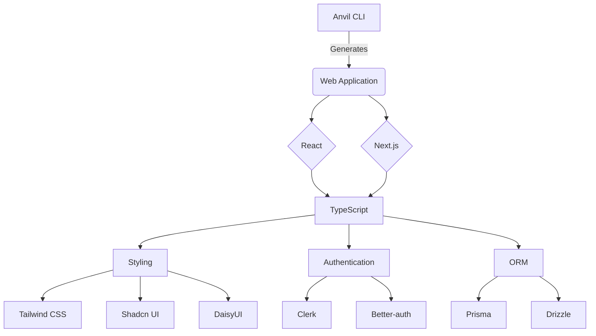
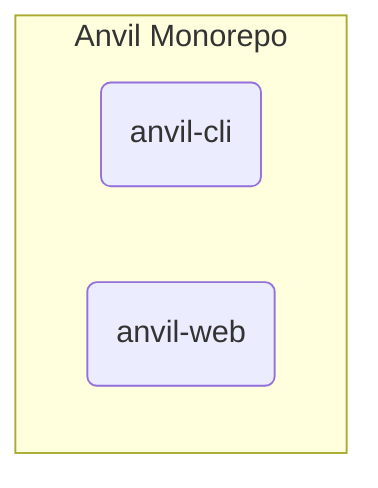

# Anvil

<p align="center">
  
  
  
  
  
</p>

<p align="center">
  <strong>A powerful CLI tool for rapidly bootstrapping modern web applications with best-in-class tooling and configurations.</strong>
</p>

<p align="center">
  Anvil is an open-source project dedicated to making web development faster and more efficient. We welcome contributors from all backgrounds to help us build the future of web application scaffolding.
</p>

## 🚀 Overview

Anvil is a comprehensive project bootstrapping tool designed to streamline the setup process for web applications. It offers an interactive CLI experience to configure your project with the frameworks and tools you need, eliminating the hassle of manual setup and configuration.



## ✨ Features

- **Interactive Setup**: A user-friendly CLI that guides you through every step of project creation.
- **Multiple Frameworks**: Choose between React and Next.js, both pre-configured with TypeScript.
- **Styling Options**: Seamlessly integrate your favorite styling solutions, including Tailwind CSS, Shadcn UI, and DaisyUI.
- **Authentication**: Easily add authentication to your project with providers like Clerk and Better-auth.
- **Database Integration**: Built-in support for popular ORMs like Prisma and Drizzle.
- **Package Manager Choice**: Use your preferred package manager: npm, yarn, or pnpm.
- **Extensible**: Designed to be easily extended with new templates, frameworks, and tools.

## 📋 Project Structure

The Anvil repository is a monorepo containing two main packages:

- `anvil-cli`: The command-line interface for generating new projects.
- `anvil-web`: A web-based interface for managing and visualizing your Anvil projects (under development).



## 🔧 Installation

To get started with Anvil, clone the repository and install the dependencies:

```bash
# Clone the repository
git clone https://github.com/iaadi4/anvil.git
cd anvil

# Install dependencies for the web interface
cd anvil-web
pnpm install

# Install dependencies for the CLI
cd ../anvil-cli
pnpm install
```

To use the Anvil CLI from anywhere on your system, you can link it globally:

```bash
# From the anvil-cli directory
npm link
```

## 🚀 Usage

### Using the CLI

To create a new project with Anvil, run the following command:

```bash
# If linked globally
create-anvil

# Or run directly from the project
cd anvil/anvil-cli
pnpm build
pnpm create-anvil
```

This will launch an interactive setup wizard that will guide you through the process of configuring your new project.

## 🛠️ Available Configurations

Anvil offers a wide range of configurations to suit your needs. Here are some of the available options:

### Frameworks
- React with TypeScript
- Next.js with TypeScript

### Styling
- Tailwind CSS
- Shadcn UI (requires Tailwind and TypeScript)
- DaisyUI (requires Tailwind)

### Authentication
- Better-auth
- Clerk
- NextAuth (when using Next.js)

### ORMs
- Prisma
- Drizzle

### Package Managers
- npm
- yarn
- pnpm

## 🤝 Contributing

We welcome contributions from the community! If you'd like to contribute to Anvil, please follow these steps:

1.  **Fork the repository** and create a new branch for your feature or bug fix.
2.  **Make your changes** and ensure that the code is well-tested.
3.  **Submit a pull request** with a clear description of your changes.

For more information, please see our [Contributing Guide](CONTRIBUTING.md).

## 📞 Community and Support

If you have any questions, or suggestions, or just want to connect with the community, you can find us on:

- **GitHub Issues**: [https://github.com/iaadi4/anvil/issues](https://github.com/iaadi4/anvil/issues)

## 📄 License

Anvil is open-source software licensed under the [MIT License](LICENSE).