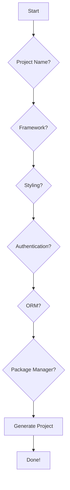

# Anvil CLI

<p align="center">
  <a href="https://www.npmjs.com/package/create-anvil-app"></a>
  
  
</p>

<p align="center">
  <strong>A powerful CLI tool for rapidly bootstrapping modern web applications with best-in-class tooling and configurations.</strong>
</p>

Anvil streamlines the process of starting new web projects by providing a flexible and interactive command-line interface. With Anvil, you can generate a new project with your preferred framework, styling, authentication, and more, all in a matter of minutes.

## 🚀 Quick Start

To create a new project with Anvil, use your favorite package manager:

### npm
```bash
npx create-anvil-app
```

### pnpm
```bash
pnpm create anvil-app
```

### yarn
```bash
yarn create anvil-app
```

This will launch an interactive setup wizard that will guide you through the process of configuring your new project.



## ✨ Features

- **Interactive Setup**: A user-friendly CLI that guides you through every step of project creation.
- **Multiple Frameworks**: Choose between React (with Vite) and Next.js, both pre-configured with TypeScript.
- **Styling Options**: Seamlessly integrate your favorite styling solutions, including Tailwind CSS, Shadcn UI, DaisyUI, and NextUI.
- **Authentication**: Easily add authentication to your project with providers like Clerk, NextAuth, and Better-Auth.
- **Database Integration**: Built-in support for popular ORMs like Prisma and Drizzle.
- **Package Manager Choice**: Use your preferred package manager: npm, yarn, or pnpm.
- **Docker Support**: Optionally add a Docker configuration to your project.
- **Extensible**: Designed to be easily extended with new templates, frameworks, and tools.

## 🛠️ Available Configurations

Anvil offers a wide range of configurations to suit your needs. Here are some of the available options:

### Frameworks
- **React with TypeScript**: A modern React setup powered by Vite.
- **Next.js with TypeScript**: The latest version of Next.js with the App Router.

### Styling Libraries
- **Tailwind CSS**: A utility-first CSS framework for rapid UI development.
- **Shadcn UI**: A collection of re-usable components built with Radix UI and Tailwind CSS.
- **DaisyUI**: A component library for Tailwind CSS that provides a set of pre-designed components.
- **NextUI**: A beautiful, fast, and modern React UI library.

### Authentication Providers
- **Clerk**: A complete user management solution with pre-built UI components.
- **NextAuth**: A flexible authentication library for Next.js applications.
- **Better-Auth**: A modern authentication library for Next.js.

### ORMs
- **Prisma**: A next-generation Node.js and TypeScript ORM.
- **Drizzle**: A lightweight and efficient TypeScript ORM.

## 📄 License

Anvil is open-source software licensed under the [MIT License](LICENSE).

## 🤝 Contributing

We welcome contributions from the community! If you'd like to contribute to Anvil, please see our [main repository](https://github.com/iaadi4/anvil) for contribution guidelines.

## 🐛 Issues

If you encounter any issues or have suggestions for improvements, please [file a bug report](https://github.com/iaadi4/anvil/issues) on our main repository.